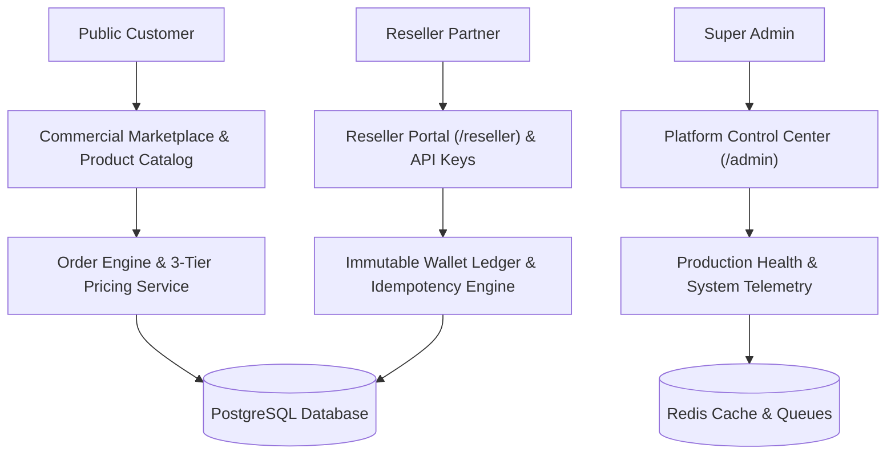

# Commercial B2B2C Multi-Tenant SaaS Platform

<p align="center">
  
  
  
  
  
  
  
</p>

<p align="center">
  <b>A turnkey, enterprise-grade B2B2C Multi-Tenant SaaS Platform featuring automated web installation, 3-tier role pricing, immutable financial transaction ledger, reseller partner onboarding, recurring subscription automation, and production observability.</b>
</p>

---

## 🌟 Key Platform Features

- ⚡ **Automated Web Installer Wizard (`/install`)**: Graphical step-by-step installation setup for cPanel, Shared Hosting, and VPS. Tests database connection, checks server requirements, and creates Super Admin.
- 💰 **3-Tier Role Pricing Architecture**:
  - **Super Admin**: Cost Price + Reseller Price + Customer Retail Price + Platform Margin.
  - **Reseller Partner**: Reseller Partner Price + Customer Retail Price + Reseller Commission.
  - **Customer**: Retail Price only (Cost & Reseller margins strictly hidden).
- 🛡️ **Immutable Financial Ledger**: Wallet credit/debit transaction ledger with PostgreSQL row-locking (`lockForUpdate()`), idempotency key verification, and zero double-spends.
- 🤝 **Reseller Partner Network**: KYC submission, credit limits, reseller onboarding workflow, partner domain branding, and partner commission tracking.
- 🔄 **Recurring Subscriptions Automation**: Automated renewal schedules, grace period retries, multi-channel renewal reminders (Email, SMS, WhatsApp, In-App).
- 🏬 **Commercial Marketplace**: Dynamic product/service catalog, personalized recommendations, wishlists, ratings/reviews, and item compare drawer.
- 🔌 **Developer REST API & Webhooks**: Secret API key management (`sk_live_...`), permission scopes, webhook event subscriptions (`whsec_...`), and real-time request telemetry logs.
- 📊 **Production Observability & Control Center**: Live DB latency, Redis cache, queue worker, failed jobs, disk usage telemetry, and Ctrl+K global command search.

---

## 🏗️ Platform System Architecture



---

## 🚀 Quick Start & Installation

### Option 1: Web Installer Wizard (cPanel / Shared Hosting)

1. Upload files to your web server document root.
2. Open `https://your-domain.com/install` in your browser.
3. Follow the 5-step graphical wizard to test your database and create your Super Admin account.

Read the detailed guide in [`CPANEL_DEPLOYMENT_GUIDE.md`](./CPANEL_DEPLOYMENT_GUIDE.md).

### Option 2: Docker Compose (Local & VPS Deployment)

```bash
# 1. Clone repository
git clone https://github.com/your-org/b2b2c-saas-platform.git
cd b2b2c-saas-platform

# 2. Copy production environment file
cp backend/.env.example backend/.env

# 3. Launch Docker containers (PostgreSQL, Redis, App, Nginx, Queue, Worker)
docker compose up -d --build

# 4. Run database migrations & seeders
docker compose exec app php artisan migrate --force
docker compose exec app php artisan db:seed --force

# 5. Access application
# Public App: http://localhost:3000
# Admin Login: admin@saasplatform.com / Admin@1234
```

---

## 🧪 Automated Verification & Test Suite

The platform includes **48 comprehensive Pest unit & feature tests (261 assertions)** covering authentication, tenant isolation, atomic wallet transactions, subscription renewal state machines, and financial reconciliation.

```bash
docker compose exec app ./vendor/bin/pest
```

```text
   PASS  Tests\Feature\PlatformTest
  ✓ Authentication → registers customer, rejects duplicate emails, issues tokens
  ✓ Tenant Isolation → reseller isolation and cross-org access protection
  ✓ Pricing Visibility → strictly enforces 3-tier price visibility rules
  ✓ Wallet Core → atomic credits, debits, idempotency keys, immutability
  ✓ SaaS Monetization → plan quotas and subscription checkout
  ✓ Observability → public health probes and system telemetry
  ✓ Production Stress → concurrent debits, IDOR, anti-price manipulation

  Tests:    48 passed (261 assertions)
```

---

## 📄 Documentation Sitemap

- [cPanel Deployment & Installer Guide](./CPANEL_DEPLOYMENT_GUIDE.md)
- [Production Release Checklist](./RELEASE_CHECKLIST.md)
- [Developer API & Webhook Guide](./frontend/src/pages/reseller/DeveloperPage.tsx)

---

## 📜 License

This project is open-source under the [MIT License](LICENSE).
